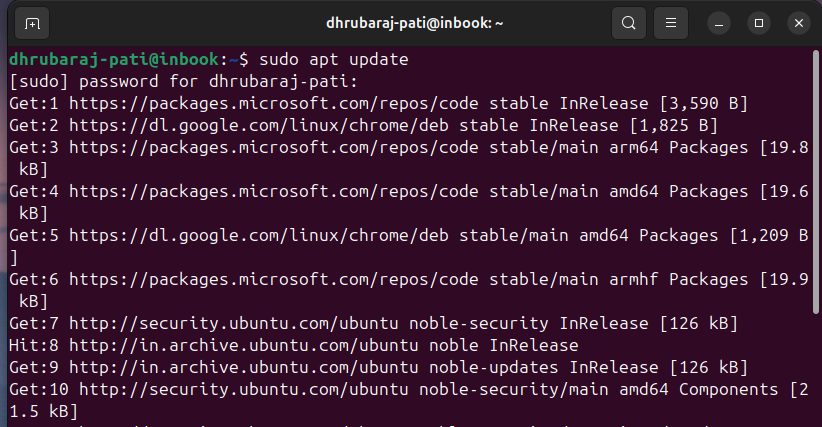
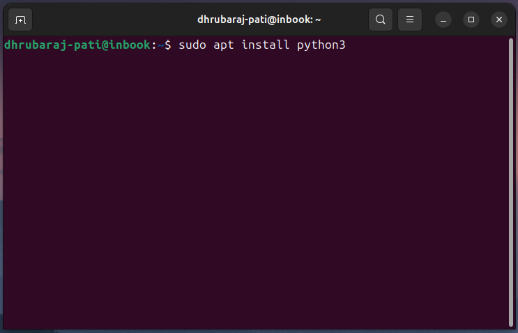

## Python Installation Guide Linux System (Ubuntu/Debian)


### Step 1: Update Packages

```bash
sudo apt update
```

<p>
  
</p>

---

### Step 2: Install Python

```bash
sudo apt install python3
```

<p>
  
</p>

---

### Step 3: Verify Installation

```bash
python3 --version
python3 -V
```

<p>
  
</p>

---

### All Set ✅

You’ve successfully installed Python on your system. **Happy coding!**

---

[Introduction to Python](https://github.com/codewithdhruba01/Learn-python-language/tree/master/01_Introduction)
