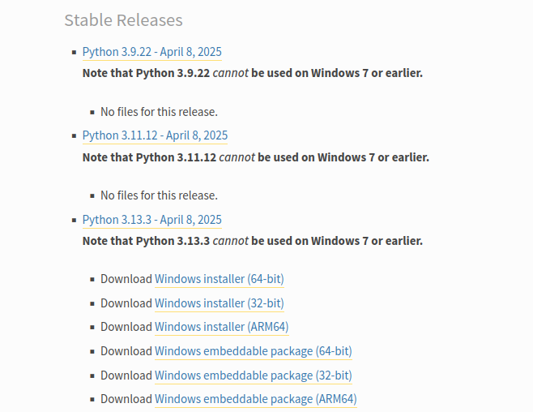
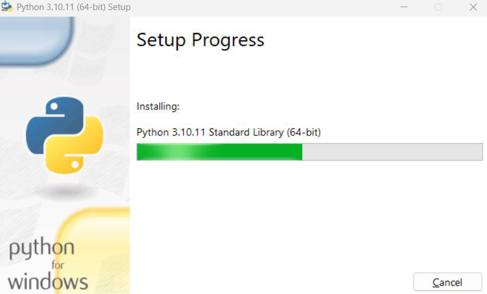
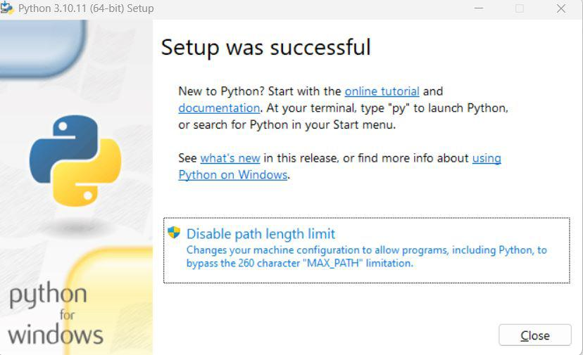

## Python Installation Guide Windows System


---

#### This guide will help you install **Python** step by step on **Windows** systems. Each step includes clear instructions and screenshots to help you.


## Installing Python on Windows

>  **Step 1:** Go to the official Python website: [https://www.python.org/downloads/](https://www.python.org/downloads/)

> **Step 2:** Click the Download Python button (You can Download any version as your requirement.)

<p>
  
</p>

> **Step 3:** Open the downloaded `.exe` file.

> **Step 4:** Make sure check the box that says **Add Python to PATH**.

<p>
  
</p>


> **Step 5:** Once you click the Install Now button, the Python setup will begin **installing Python on your Windows system.** During this process, you will see a **progress window** like the one below.

<p>
  
</p>

> **Step 6:** Once the installation is complete, Python will be successfully installed on your Windows system. A confirmation message will appear indicating the successful setup.

<p>
  
</p>

### Verify Installation

> **Step 8:** Open **Command Prompt** and type:

```
python --version
python -V
```

 You should see the **Python version displayed.**

<p>
  
</p>


### All Set ✅

You’ve successfully installed Python on your system. **Happy coding!**

---

[Introduction to Python](https://github.com/codewithdhruba01/Learn-python-language/tree/master/01_Introduction)